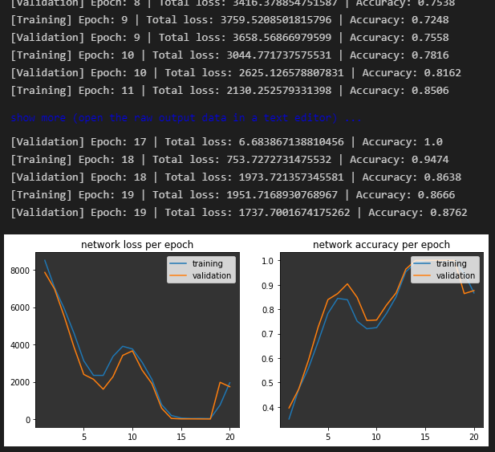

# Multi-class image classification
- [STL-10 dataset](https://cs.stanford.edu/~acoates/stl10/)
- Contains 10 unique classes

Run the project using docker:
```bash
git clone git@github.com:JThissen/machine_learning.git
cd machine_learning/multi_class_image_classification
docker build -t multi_class_image_classification -f build.Dockerfile .
docker run multi_class_image_classification
```

Or, if you'd rather run it locally *(make sure to uncomment `# torch==1.10.0+cu102` and `# torchvision==0.11.1+cu102` in `requirements.txt`)*:
```bash
git clone git@github.com:JThissen/machine_learning.git
cd machine_learning/multi_class_image_classification
pip install -r requirements.txt
python main.py
```

## Results

